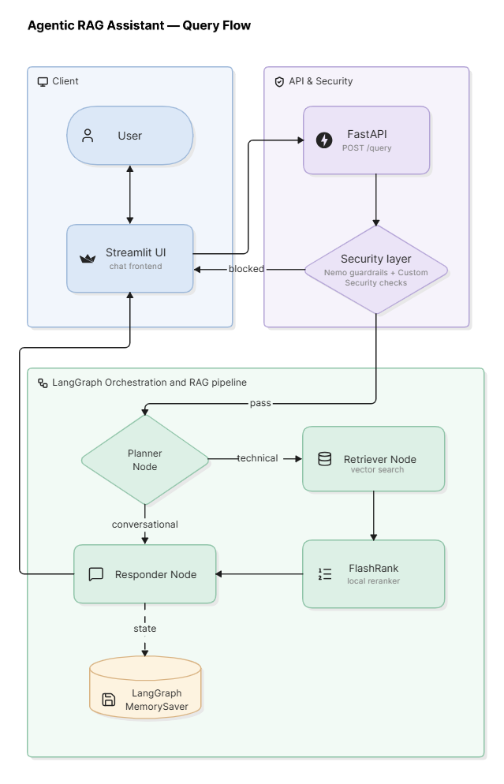

# Architecture

High-level system overview for the Agentic RAG assistant — how components connect at runtime and how data flows through the pipeline.

---

## System Diagram

---

## Components

The system has three layers:

| Layer | Role |
|-------|------|
| **Client** | Streamlit chat UI — user input, reasoning steps, source citations, session memory |
| **API & Security** | FastAPI backend — receives queries, runs guardrails, returns answers |
| **LangGraph & RAG** | Agent orchestration — plans intent, retrieves docs, synthesises responses |

---

## Query Flow

1. **User** sends a question through the Streamlit chat UI.
2. **FastAPI** receives a `POST /query` request with the message and session ID.
3. **Security layer** runs first (NeMo Guardrails + custom checks).
   - If **blocked** → a safe canned response is returned; retrieval is skipped.
   - If **allowed** → the request enters the LangGraph pipeline.
4. **Planner** decides whether the question is conversational or needs document lookup.
5. **Retriever** (technical path only) searches Qdrant, then reranks results with FlashRank.
6. **Responder** generates the final answer using Groq (Llama 3.3).
7. **MemorySaver** persists conversation state per session so follow-up questions retain context.
8. The answer flows back to the Streamlit UI.

---

## Ingestion Flow

Document indexing runs separately from live queries:

1. Raw files (PDF, HTML, TXT, DOCX, PPTX) are placed in `DATA/`.
2. Text is extracted, chunked, and embedded with Gemini.
3. Vectors are stored in **Qdrant** under the `multimodal_agentic_rag` collection.
4. At query time, the Retriever searches this collection — no re-ingestion needed per question.

---

## External Services

| Service | Purpose |
|---------|---------|
| **Groq** | LLM for planning, answering, and security classification |
| **Google Gemini** | Document and query embeddings |
| **Qdrant** | Vector database for semantic search |
| **FlashRank** | Local cross-encoder reranking (runs on the server) |
| **NeMo Guardrails** | Conversational rails and policy enforcement |
| **Logfire** | Distributed tracing across UI, API, and ingestion |

---

## Design Decisions

| Decision | Rationale |
|----------|-----------|
| **Agentic routing** | Skip retrieval for greetings and memory-only turns — faster and cheaper |
| **Two-stage retrieval** | Vector search (recall) + FlashRank rerank (precision) |
| **Security before RAG** | Block unsafe or off-topic input before any document lookup or LLM synthesis |
| **Thread-based memory** | Each chat session gets its own conversation history via LangGraph checkpointer |
| **Separate ingestion** | Index documents once; serve many queries without re-processing files |

---

## Further Reading

| Topic | Doc |
|-------|-----|
| Agent nodes and routing | [agents.md](./agents.md) |
| Document ingestion | [ingestion.md](./ingestion.md) |
| Embeddings, Qdrant, FlashRank | [retrieval.md](./retrieval.md) |
| Guardrails and security | [security.md](./security.md) |

---

  <a href="../README.md">← Back to README</a>

