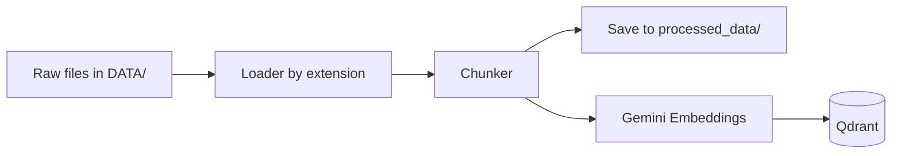

# Ingestion

This document covers how raw documents are parsed, chunked, embedded, and indexed into Qdrant — turning files in `DATA/` into searchable knowledge for the RAG agent.

---

## Pipeline



Each file goes through five steps in `app/ingestion/processor.py`:

1. **Parse** — extract plain text from the file
2. **Chunk** — split into retrieval-sized pieces
3. **Cache** — save chunk metadata locally as JSON
4. **Embed** — generate vectors with Gemini
5. **Index** — upsert points into the Qdrant collection

---

## Supported Formats

| Extension | Loader | Library |
|-----------|--------|---------|
| `.pdf` | `loaders/pdf.py` | pypdf (+ pdfplumber fallback) |
| `.html`, `.htm` | `loaders/html.py` | BeautifulSoup |
| `.txt` | `loaders/text.py` | Built-in file read |
| `.docx`, `.pptx` | `loaders/office.py` | python-docx, python-pptx |

Unsupported extensions are skipped with a warning log.

---

## Folder Layout

Place documents under `DATA/`. The processor supports two modes:

### Sub-folder mode (recommended)

```
DATA/
├── true_data/       → source_type: "true"
├── noisy_data/      → source_type: "noisy"
└── general/         → source_type: "general"
```

Sub-folder names containing `true` or `noisy` are mapped automatically. Other folder names become their own source type.

### Flat mode

If `DATA/` has no sub-folders, all files are ingested as a single source type inferred from the directory name, or passed explicitly via CLI.

---

## Commands

```bash
# Full re-ingest — drops and recreates the Qdrant collection
python -m app.ingestion.processor DATA --wipe

# Append / update without wiping
python -m app.ingestion.processor DATA

# Ingest a specific folder with explicit source type
python -m app.ingestion.processor DATA/true_data true
```

Requires `GEMINI_API_KEY`, `QDRANT_API_KEY`, and `QDRANT_CLUSTER_ENDPOINT` in `.env`.

---

## Chunking

**File:** `app/ingestion/chunking/splitter.py`

| Setting | Default |
|---------|---------|
| Chunk size | 1500 characters |
| Overlap | 150 characters |

Paragraph-aware splitting: breaks on `\n\n`, handles oversized paragraphs (code blocks, YAML, tables), and carries overlap between consecutive chunks.

For embedding and search details, see [retrieval.md](./retrieval.md).

---

## Qdrant Indexing

| Setting | Value |
|---------|-------|
| Collection | `multimodal_agentic_rag` |
| Distance | Cosine |
| Vector dim | 3072 (Gemini) |
| Point ID | Deterministic UUID5 from `{filename}:{chunk_index}` |

Each point stores:

- `text` — original chunk content
- `source` — filename
- `source_type` — folder type (e.g. `true`)
- `chunk_index` — position within the file

Embeddings use an enriched prefix (`Source: filename | Chunk N/M`) while the payload keeps clean text for display.

---

## Local Cache

Parsed chunks are saved to `processed_data/<source_type>/<filename>.json` before indexing. This acts as a local audit trail — useful for debugging chunk quality without re-parsing files.

---

## Troubleshooting

| Issue | Fix |
|-------|-----|
| No text extracted | Check file isn't empty or image-only PDF |
| Dimension mismatch | Re-run with `--wipe` to recreate the collection |
| Gemini rate limits during ingest | Retry; embeddings batch in groups of 50 with backoff |
| Collection not found | Run ingestion at least once to create it |

---

## File Reference

```
app/ingestion/
├── processor.py          # CLI entry point and orchestration
├── chunking/splitter.py  # Paragraph-aware chunker
└── loaders/
    ├── pdf.py
    ├── html.py
    ├── text.py
    └── office.py         # DOCX + PPTX
```

---

## Related Docs

| Topic | Doc |
|-------|-----|
| System Overview | [1_architecture.md](./1_architecture.md) |
| Agent nodes and routing | [3_agents.md](./3_agents.md) |
| Embeddings, Qdrant, FlashRank | [4_retrieval.md](./4_retrieval.md) |
| Guardrails and security | [5_security.md](./5_security.md) |

---

- [README.md](../README.md) — setup and usage
