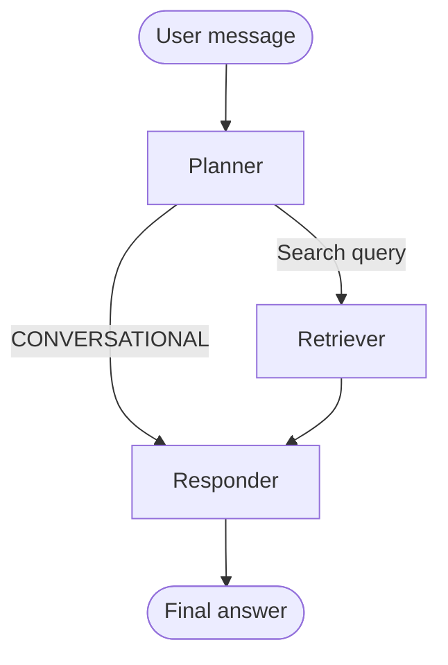
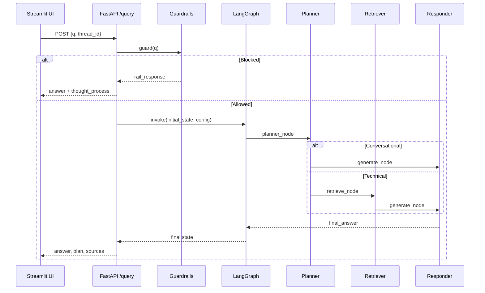

# Agents

This document describes the LangGraph agent workflow: how requests flow through the Planner, Retriever, and Responder nodes, how state is managed, and how conversational memory works.

---

## Overview

The RAG agent is a **three-node LangGraph state machine** compiled in `app/agents/graph.py`. Each user question triggers a run that:

1. Starts at the **Planner** — decides whether retrieval is needed
2. Optionally runs the **Retriever** — fetches and reranks document chunks
3. Ends at the **Responder** — synthesizes the final answer with Groq (Llama 3.3)

The graph is invoked from `app/main.py` via `POST /query`, after guardrails pass.



View the live graph diagram at `http://localhost:8000/graph` while the backend is running.

---

## Agent State

All nodes read and write a shared `AgentState` defined in `app/agents/state.py`:

| Field | Type | Purpose |
|-------|------|---------|
| `messages` | `List[dict]` | Conversation history (`role`, `content`). Appended via `operator.add` — never replaced |
| `current_query` | `str` | Planner output: either `"CONVERSATIONAL"` or a refined search query |
| `documents` | `List[str]` | Retrieved context chunks (with source headers), populated by Retriever |
| `plan` | `List[str]` | Reasoning steps shown in the UI as `thought_process` |
| `status` | `str` | Human-readable pipeline status |
| `final_answer` | `str` | Generated response from the Responder |

### Initial state (per request)

When `/query` receives a request, it seeds the graph with:

```python
{
    "messages": [{"role": "user", "content": q}],
    "current_query": q,
    "documents": [],
    "plan": ["Start"],
    "status": "Initializing Graph..."
}
```

Each node returns a **partial update** — only the fields it changes. LangGraph merges these into the running state.

---

## Graph Topology

Defined in `app/agents/graph.py`:

| Node | Function | Role |
|------|----------|------|
| `planner` | `planner_node` | Intent classification and query refinement |
| `retriever` | `retrieve_node` | Vector search + reranking |
| `responder` | `generate_node` | LLM answer synthesis |

**Routing logic** (`route_planner`):

- If `current_query == "CONVERSATIONAL"` → go directly to `responder`
- Otherwise → go to `retriever`, then `responder`

**Edges:**

```
planner  → (conditional) → retriever | responder
retriever → responder
responder → END
```

---

## Node 1: Planner

**File:** `app/agents/nodes/planner.py`  
**Model:** Groq `llama-3.3-70b-versatile` (temperature `0`)

### What it does

The Planner reads the **full conversation history** plus the latest user message and decides:

1. **Conversational** — greeting, farewell, or a question answerable from chat history alone (e.g. "what is my name?")
2. **Technical** — a question about Kubernetes, Intel, or networking that needs fresh documentation

### Output

| Decision | `current_query` | `plan` entries |
|----------|-----------------|----------------|
| Conversational | `"CONVERSATIONAL"` | `Intent: Conversational/Memory`, `Retrieval: Skipped` |
| Technical | Refined search string | `Intent: Technical`, `Search Term: <query>` |

The LLM is instructed to output **only** `CONVERSATIONAL` or the search query — no extra text.

### Why it matters

Skipping retrieval for conversational turns:

- Reduces latency and API cost
- Avoids irrelevant document noise in the prompt
- Lets follow-up questions use thread memory instead of re-searching

---

## Node 2: Retriever

**File:** `app/agents/nodes/retriever.py`

> Only runs when the Planner outputs a technical search query. See [retrieval.md](./retrieval.md) for embedding, Qdrant, and FlashRank details.

### What it does

1. Calls `search_enterprise_knowledge(query, limit=15)` — cosine similarity search in Qdrant
2. Extracts raw chunk text from the top 15 candidates
3. Reranks with FlashRank, keeping the **top 5**
4. Re-attaches source metadata and formats chunks for the Responder

### Output format

Each document passed to the Responder looks like:

```
[Source: job_management.html

<chunk text here>
```

### State updates

```python
{
    "documents": formatted_docs,
    "status": "Found technical context.",
    "plan": state["plan"] + ["Context Retrieved"]
}
```

---

## Node 3: Responder

**File:** `app/agents/nodes/responder.py`  
**Model:** Groq `llama-3.3-70b-versatile` (temperature `0.1`)

### Two modes

#### Conversational mode (`current_query == "CONVERSATIONAL"`)

- Uses **conversation history only** — no retrieved documents
- Friendly, natural tone
- Suitable for greetings, memory-based follow-ups

#### Technical RAG mode

- Uses **retrieved context + conversation history**
- Instructed to answer **only** from the provided technical context
- Must state when information is not available in context
- Context is capped at **25,000 characters** to stay within Groq token limits (truncation is logged)

### Prompt guidelines (technical mode)

The Responder is told to:

- Write clear, structured answers
- Use history to interpret follow-up questions
- Not mention filenames, sources, or that it was given context
- Respond naturally, as if it already knows the information

### Output

```python
{
    "final_answer": content,
    "status": "Response generated.",
    "plan": state["plan"],
    "messages": [{"role": "assistant", "content": content}]
}
```

The `messages` append ensures the assistant reply is stored in thread memory for future turns.

---

## Conversational Memory

The graph is compiled with LangGraph's `MemorySaver` checkpointer:

```python
checkpointer = MemorySaver()
rag_agent = workflow.compile(checkpointer=checkpointer)
```

Memory is keyed by **`thread_id`** passed in the `/query` request (default: `"default_user"`). The Streamlit UI generates a UUID per session and sends it on every call.

| Concept | Implementation |
|---------|----------------|
| Session ID | `thread_id` in `config = {"configurable": {"thread_id": thread_id}}` |
| History storage | LangGraph checkpointer persists state between invocations |
| UI session | `st.session_state.session_id` in `ui/app.py` |
| Clear memory | UI "Clear History" button generates a new `session_id` |

On each new message, only the latest user turn is added to `initial_state["messages"]`, but the checkpointer merges prior thread state — so the Planner and Responder see full history.

---

## Request Lifecycle (end-to-end)



### API response mapping

| Graph field | API response field |
|-------------|-------------------|
| `final_answer` | `answer` |
| `plan` | `thought_process` |
| `documents` | `sources` |
| `status` | `status` |

---

## Observability

Each node emits Logfire spans:

| Span | Node |
|------|------|
| `🧠 Planner Decision` | Planner |
| `🔍 Knowledge Retrieval` | Retriever |
| `⚖️ Semantic Reranking` | Retriever (nested) |
| `✍️ LLM Synthesis` | Responder |

Use these spans to debug routing mistakes, empty retrieval, or slow LLM calls.

---

## Extending the Agent

Common extension points:

| Goal | Where to change |
|------|-----------------|
| Add a new node (e.g. query rewrite) | `app/agents/graph.py` — add node + edges |
| Change routing logic | `route_planner()` in `graph.py` |
| Adjust planner intent rules | Prompt in `planner.py` |
| Change retrieval depth | `limit=` and `top_n=` in `retriever.py` |
| Tune answer style / grounding rules | Prompt in `responder.py` |
| Add new state fields | `app/agents/state.py` + node return dicts |

When adding nodes, always return partial state updates and append to `plan` so the UI continues to show a clear reasoning trail.

---

## Related Docs

- [retrieval.md](./retrieval.md) — embeddings, Qdrant search, FlashRank reranking
- [README.md](../README.md) — setup and usage
