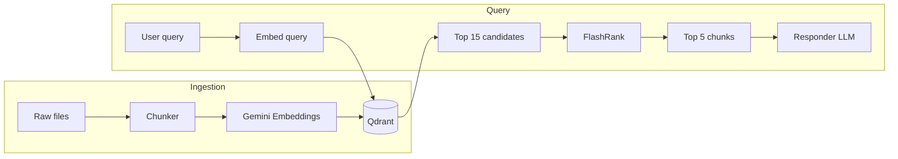
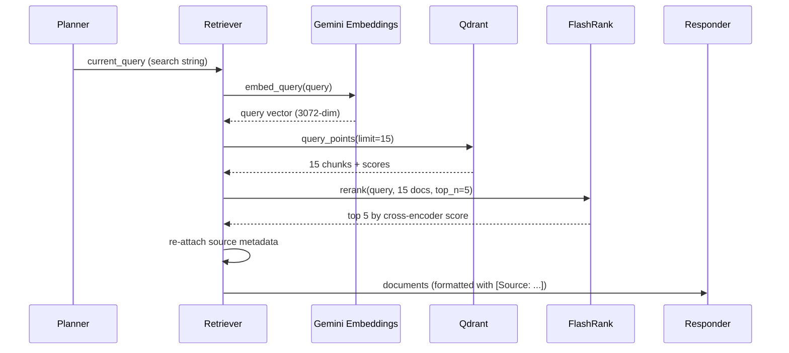

# Retrieval

This document describes how documents are embedded, stored, searched, and reranked — the full retrieval pipeline from ingestion to the agent's context window.

---

## Overview

Retrieval happens in two phases:

| Phase | When | What happens |
|-------|------|--------------|
| **Indexing** | Ingestion (`app/ingestion/processor.py`) | Parse → chunk → embed → upsert to Qdrant |
| **Query-time** | Agent Retriever node | Embed query → vector search → FlashRank rerank → top chunks to LLM |



---

## Embeddings

**File:** `app/services/retrieval/embedding.py`

### Model

| Setting | Value |
|---------|-------|
| Provider | Google Gemini |
| Model | `models/gemini-embedding-2-preview` |
| Dimensions | **3072** |
| API key | `GEMINI_API_KEY` in `.env` |

The model is initialized **lazily** on first use. A probe call (`embed_query("probe")`) verifies connectivity at startup.

### Public API

| Function | Use case |
|----------|----------|
| `embed_query(text)` | Single query string → one vector (used at search time) |
| `embed_texts(texts)` | Batch embed a list of strings (used during ingestion) |
| `get_embedding_dim()` | Returns `3072` — used when creating the Qdrant collection |

### Batching and retries

- Ingestion batches chunks in groups of **50** (`BATCH_SIZE`)
- On Gemini rate limits (`429`, quota errors), exponential backoff: 1s → 2s → 4s → 8s (up to 4 attempts)
- All batch operations are wrapped in Logfire spans (`Embed batch`)

---

## Chunking (Indexing Input)

**File:** `app/ingestion/chunking/splitter.py`

Before embedding, raw document text is split into retrieval-friendly chunks.

| Parameter | Default | Purpose |
|-----------|---------|---------|
| `chunk_size` | 1500 chars | Max chunk length |
| `overlap` | 150 chars | Overlap between consecutive chunks for context continuity |

### Strategy

1. Split on double newlines (paragraph boundaries)
2. Split oversized paragraphs into fixed-size pieces (handles YAML, code blocks, tables)
3. Group paragraphs into chunks up to `chunk_size`
4. Carry forward the last `overlap` characters when starting a new chunk

This paragraph-aware approach works better on technical docs than naive sentence splitting.

---

## Qdrant Vector Store

### Configuration

**File:** `app/config.py`

| Setting | Value |
|---------|-------|
| Collection name | `multimodal_agentic_rag` |
| Endpoint | `QDRANT_CLUSTER_ENDPOINT` |
| API key | `QDRANT_API_KEY` |
| Distance metric | **Cosine** |

The collection is created automatically during ingestion if it does not exist. Vector dimension is resolved at runtime via `get_embedding_dim()`.

### Point schema

Each indexed chunk becomes one Qdrant point:

| Field | Source |
|-------|--------|
| `id` | Deterministic UUID5 from `{filename}:{chunk_index}` |
| `vector` | Gemini embedding of enriched chunk text |
| `payload.text` | Original chunk text |
| `payload.source` | Filename (e.g. `job_management.html`) |
| `payload.source_type` | Folder type (e.g. `true`, `noisy`) |
| `payload.chunk_index` | Zero-based index within the file |

### Enriched embedding text

During ingestion, the text sent to the embedding model is **enriched** with metadata:

```
Source: job_management.html | Chunk 3/12

<actual chunk content>
```

The **original chunk text** (without the prefix) is stored in `payload.text`. This helps the embedding model associate chunks with their source while keeping clean text for display and LLM context.

### Indexing command

```bash
python -m app.ingestion.processor DATA --wipe
```

Use `--wipe` to drop and recreate the collection before a full re-ingest.

---

## Vector Search (Query Time)

**File:** `app/services/retrieval/qdrant_service.py`

### `search_enterprise_knowledge(query, limit=8)`

1. Embed the query with `embed_query()`
2. Call Qdrant `query_points()` on collection `multimodal_agentic_rag`
3. Return a list of dicts:

```python
{
    "content": "<chunk text>",
    "source": "<filename>",
    "score": <cosine similarity score>
}
```

### Limits in practice

| Stage | Count | Where set |
|-------|-------|-----------|
| Qdrant candidates | **15** | `retrieve_node()` passes `limit=15` |
| After reranking | **5** | `rerank_documents(..., top_n=5)` |

The service default is `limit=8`, but the Retriever node overrides it to **15** to give FlashRank a wider candidate pool.

### Error handling

If Qdrant search fails, the function logs the error and returns an **empty list**. The Responder will then answer without context (and should indicate information is unavailable per its prompt rules).

---

## FlashRank Reranking

**File:** `app/services/retrieval/ranking_service.py`

### Why rerank?

Vector search (cosine similarity on embeddings) is fast but approximate — it can surface chunks that are semantically nearby but not the best match for the exact question.

**FlashRank** applies a **cross-encoder** that scores each `(query, document)` pair jointly. Cross-encoders are more accurate than bi-encoder embeddings but slower. FlashRank mitigates this with a quantized **ONNX** model running **locally**.

### Model

| Setting | Value |
|---------|-------|
| Engine | FlashRank (`flashrank` package) |
| Base model | `ms-marco-MiniLM-L-6-v2` (via ONNX) |
| Cache dir | `/tmp/flashrank` (fallback: default cache) |
| Initialization | Lazy — loaded on first rerank call |

### `rerank_documents(query, documents, top_n=5)`

1. Build passages: `[{"id": i, "text": doc}, ...]`
2. Create a `RerankRequest(query, passages)`
3. Run `ranker.rerank(request)` — results sorted by score descending
4. Return the top `top_n` document texts

### Fallback

If reranking fails, the function logs the error and returns the **first `top_n` documents in original Qdrant order**. The pipeline never hard-fails on reranker errors.

### Performance

Typical rerank of 15 documents completes in well under a second locally. Logfire logs duration and the top semantic score.

---

## End-to-End Retrieval Flow



### Metadata preservation after rerank

FlashRank returns only text strings. The Retriever re-maps each reranked text back to the original Qdrant result by content match to recover `source` filenames before formatting.

---

## Tunable Parameters

| Parameter | Location | Default | Effect |
|-----------|----------|---------|--------|
| Qdrant `limit` | `retriever.py` | 15 | Wider pool for reranking |
| Rerank `top_n` | `retriever.py` | 5 | Chunks sent to LLM |
| `chunk_size` | `splitter.py` | 1500 | Ingestion chunk granularity |
| `overlap` | `splitter.py` | 150 | Context overlap between chunks |
| Context cap | `responder.py` | 25,000 chars | Max retrieved text in LLM prompt |
| `BATCH_SIZE` | `embedding.py` | 50 | Ingestion embedding batch size |

### Tuning guidance

| Goal | Suggestion |
|------|------------|
| Better recall (find more relevant docs) | Increase Qdrant `limit` (e.g. 20–25) |
| Faster responses | Lower `limit` or `top_n` |
| More precise answers | Increase `top_n` slightly, or tighten chunk_size |
| Longer documents | Increase `chunk_size` with proportional overlap (~10%) |

---

## Troubleshooting

| Symptom | Likely cause | Fix |
|---------|--------------|-----|
| Empty retrieval results | Collection not ingested or wrong endpoint | Run ingestion with `--wipe`; verify `QDRANT_*` env vars |
| Dimension mismatch error | Collection created with wrong model | Wipe collection and re-ingest |
| Gemini 429 during ingest | Rate limits on embedding API | Retry; reduce batch frequency; check quota |
| Answers ignore docs | Planner routed as `CONVERSATIONAL` | Check `thought_process` in UI — should show `Intent: Technical` |
| Irrelevant sources | Embedding fuzzy match | Increase rerank pool; review chunk quality |
| FlashRank slow on first query | Cold model load | Expected once; subsequent calls are fast |

---

## File Reference

```
app/
├── ingestion/
│   ├── processor.py          # Indexing pipeline (parse → embed → upsert)
│   └── chunking/splitter.py  # Paragraph-aware chunker
└── services/retrieval/
    ├── embedding.py          # Gemini embed_query / embed_texts
    ├── qdrant_service.py     # Vector search
    └── ranking_service.py    # FlashRank reranking
```

---

## Related Docs

- [agents.md](./agents.md) — how the Retriever node fits in the LangGraph workflow
- [README.md](../README.md) — ingestion commands and environment setup
