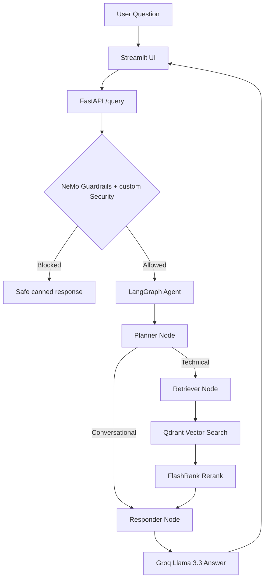

# 🤖 Agentic RAG

<div align="center">

[](https://www.python.org/)
[](https://fastapi.tiangolo.com/)
[](https://langchain-ai.github.io/langgraph/)
[](https://streamlit.io/)

[](https://groq.com/)
[](https://ai.google.dev/)
[](https://qdrant.tech/)
[](https://github.com/NVIDIA/NeMo-Guardrails)

[](LICENSE)
[](https://github.com/symonne-kannan-work/agentic-rag)

</div>

<br>

**An enterprise-grade, intelligent Agentic RAG system** that answers technical questions from your own documentation using LLM agents, semantic search, and safety guardrails.

> Built for teams that need more than a simple chatbot — this project orchestrates planning, retrieval, reranking, and grounded synthesis in a single LangGraph workflow.

---

## 📑 Table of Contents

- [Key Features](#key-features)
- [How It Works](#how-it-works)
- [Project Structure](#project-structure)
- [Tech Stack](#tech-stack)
- [Prerequisites](#prerequisites)
- [Environment Variables](#environment-variables)
- [Getting Started & Usage](#getting-started--usage)
- [API Endpoints](#api-endpoints)
- [Evaluation](#evaluation)
- [License](#license)

---

## ✨ Key Features

| Feature | Description |
|---------|-------------|
| **Agentic orchestration** | LangGraph state machine with Planner → Retriever → Responder nodes |
| **Multimodal ingestion** | Parse PDF, HTML, TXT, DOCX, and PPTX into searchable chunks |
| **Semantic search** | Gemini embeddings stored in Qdrant vector database |
| **Reranking** | FlashRank cross-encoder improves retrieval precision |
| **Conversational memory** | Thread-based memory via LangGraph checkpointer |
| **Smart routing** | Planner skips retrieval for greetings and memory-only questions |
| **Safety guardrails** | NVIDIA NeMo Guardrails and custom security checks to block prompt injection, off-topic and unsafe inputs |
| **Observability** | Logfire distributed tracing across UI, API, and ingestion |
| **Streamlit UI** | Chat interface with reasoning steps and source citations |
| **Evaluation suite** | RAGAS metrics against a golden dataset |

---

## ⚙️ How It Works



**Ingestion flow** (run once, or when documents change):

1. Drop files into `DATA/` (supports sub-folders like `true_data/`, `noisy_data/`)
2. Run the ingestion processor — it parses, chunks, embeds, and indexes into Qdrant
3. Processed metadata is saved locally under `processed_data/`

**Query flow** (runtime):

1. User sends a question via the Streamlit chat UI
2. FastAPI receives the request and runs guardrails first
3. The LangGraph agent decides whether retrieval is needed
4. For technical queries, relevant chunks are fetched and reranked
5. The responder synthesizes a grounded answer using conversation history

---

## 📦 Project Structure

```
agentic_rag/
├── app/
│   ├── main.py                 # FastAPI entry point (/query, /graph)
│   ├── config.py               # Centralized settings
│   ├── agents/
│   │   ├── graph.py            # LangGraph workflow definition
│   │   ├── state.py            # Agent state schema
│   │   └── nodes/
│   │       ├── planner.py      # Intent routing (search vs. conversational)
│   │       ├── retriever.py    # Vector search + reranking
│   │       └── responder.py    # LLM answer synthesis
│   ├── guardrails/             # NeMo Guardrails + security checks
│   ├── ingestion/
│   │   ├── processor.py        # CLI ingestion pipeline
│   │   ├── chunking/           # Text splitting
│   │   └── loaders/            # PDF, HTML, TXT, Office parsers
│   └── services/
│       └── retrieval/          # Embeddings, Qdrant, FlashRank
├── ui/
│   └── app.py                  # Streamlit chat frontend
├── evals/                      # RAG evaluation (RAGAS, golden dataset)
├── DATA/                       # Source documents for ingestion
├── DOCS/                       # Architectural and operational reference documents
├── processed_data/             # Cached chunk metadata (JSON)
├── requirements.txt
├── .env.example
└── README.md
```

---

## 🛠️ Tech Stack

| Layer | Technology |
|-------|------------|
| **Language** | Python 3.11+ |
| **API** | FastAPI + Uvicorn |
| **Frontend** | Streamlit |
| **Orchestration** | LangChain + LangGraph |
| **LLM** | Groq (Llama 3.3 70B) |
| **Eval Judge LLM** | Groq (Llama 3.3 8B) |
| **Embeddings** | Google Gemini |
| **Vector DB** | Qdrant |
| **Reranking** | FlashRank |
| **Guardrails** | NVIDIA NeMo Guardrails |
| **Tracing** | Logfire |
| **Evaluation** | RAGAS |

---

## 📋 Prerequisites

Before you begin, make sure you have:

- **Python 3.11+**
- API keys for:
  - [Groq](https://console.groq.com/) — LLM reasoning
  - [Google Gemini](https://aistudio.google.com/) — embeddings
  - [Qdrant Cloud](https://cloud.qdrant.io/) — vector storage (or a self-hosted instance)
  - [Logfire](https://logfire.pydantic.dev/) — optional but recommended for tracing

---

## 🔐 Environment Variables

Copy `.env.example` to `.env` and set the following:

| Variable | Required | Description |
|----------|----------|-------------|
| `GROQ_API_KEY` | Yes | Groq API key for Llama 3.3 (planner + responder) |
| `GEMINI_API_KEY` | Yes | Google Gemini key for embeddings |
| `QDRANT_API_KEY` | Yes | Qdrant cluster API key |
| `QDRANT_CLUSTER_ENDPOINT` | Yes | Qdrant cluster URL |
| `LOGFIRE_TOKEN` | Recommended | Pydantic Logfire token for tracing |
| `BACKEND_URL` | Optional | API URL for the UI (default: `http://localhost:8000`) |
| `JUDGE_GROQ_API_KEY` | Optional | Separate Groq key for eval judge (avoids rate limits) |

---

## 🚀 Getting Started & Usage

### 1. Clone and install

```bash
git clone https://github.com/symonne-kannan-work/agentic-rag.git
cd agentic_rag

python -m venv .venv

# Windows
.venv\Scripts\activate

# macOS / Linux
source .venv/bin/activate

pip install -r requirements.txt
```

### 2. Configure environment

```bash
cp .env.example .env
```

Fill in your API keys in `.env` (see [Environment Variables](#environment-variables) above).

### 3. Ingest documents

Place your files in `DATA/` and run one of:

```bash
# Full re-ingest — wipes the Qdrant collection first
python -m app.ingestion.processor DATA --wipe

# Append / update without wiping
python -m app.ingestion.processor DATA

# Target a specific folder with an explicit source type
python -m app.ingestion.processor DATA/true_data true
```

Supported formats: **PDF**, **HTML**, **TXT**, **DOCX**, **PPTX**.

### 4. Run the app

```bash
# Terminal 1 — Backend API
uvicorn app.main:app --reload --port 8000

# Terminal 2 — Chat UI
streamlit run ui/app.py
```

Open the Streamlit URL shown in the terminal (default: `http://localhost:8501`).

### 5. Query & explore

**Via the UI** — type your question in the chat box.

**Via the API:**

```bash
curl -X POST http://localhost:8000/query \
  -H "Content-Type: application/json" \
  -d '{"q": "How does job autoscaling work?", "thread_id": "user-123"}'
```

**Agent graph** — open `http://localhost:8000/graph` in a browser to view the LangGraph workflow as a PNG.

---

## 🔌 API Endpoints

| Method | Path | Description |
|--------|------|-------------|
| `GET` | `/` | Health check |
| `GET` | `/graph` | LangGraph workflow diagram (PNG) |
| `POST` | `/query` | Run the full RAG pipeline |

**`POST /query` body:**

```json
{
  "q": "Your question here",
  "thread_id": "optional-session-id"
}
```

**Response fields:** `answer`, `thought_process`, `sources`, `status`

---

## 📊 Evaluation

The `evals/` folder contains tools to measure RAG quality against a golden dataset:

> Requires the FastAPI backend running on :8000

Metrics include faithfulness, answer relevancy, and context recall (via RAGAS). See `evals/evaluation.ipynb` for interactive analysis.

---

## 📜 License

This project is licensed under the [MIT License](LICENSE).

---

<p align="center">
  Built with Langchain · LangGraph · Groq · Gemini · Qdrant · FlashRank · NVIDIA NeMo Guardrails · FastAPI · Streamlit · RAGAS · Logfire
</p>
